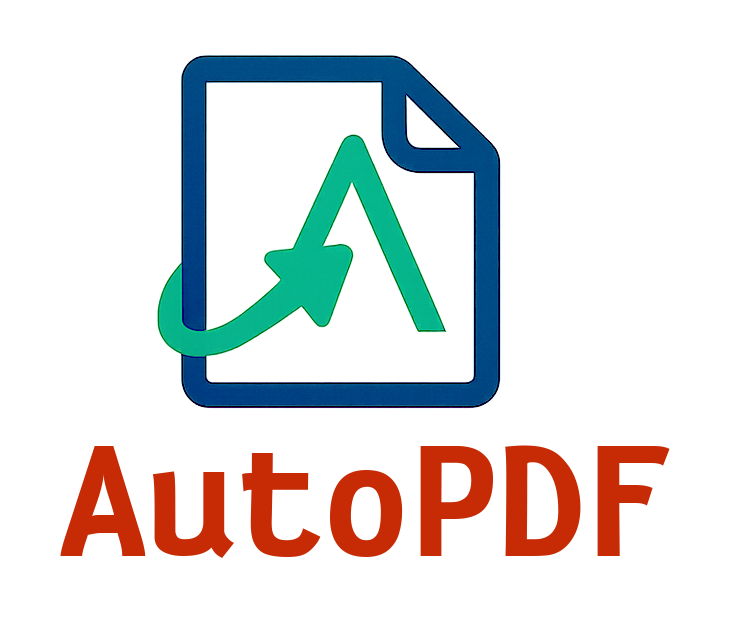
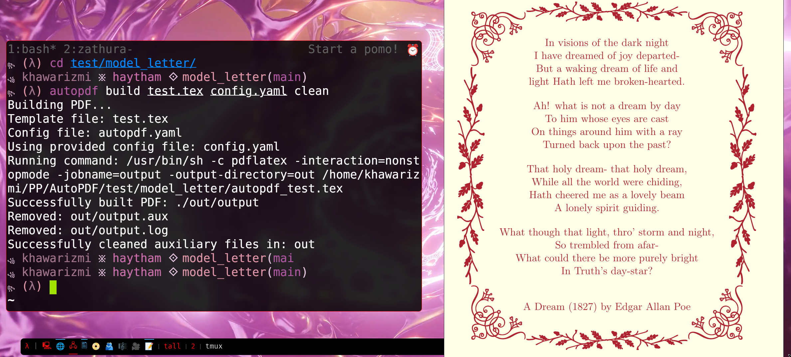

# 📄 AutoPDF 

<div align="center">



**A tool that creates PDFs, using LaTeX and Go's templating syntax.**
</div>


- :zap: Simple. Neat. Fast. Powerful. :zap:
- Perfect for creating professional, customizable PDF documents.
- *Leverages* the most powerful PDF document generator: $\LaTeX$.

> *Like, Share, Subscribe, and Hit the Bell Icon!* 

**Please do mention the software usage in your projects, products, etc.**


Built with ❤️ by [BuddhiLW](https://github.com/BuddhiLW). Using [Bonzai](https://github.com/rwxrob/bonzai) 🌳.

## Showcase

<div align="center">

</div>

## Install

```bash
go install github.com/BuddhiLW/AutoPDF/cmd/autopdf@latest
```

## Usage

### Build

```bash
cd ./internal/autopdf/test-data

autopdf build template.tex config.yaml # [optional: `clean`]
file out/output.pdf
```

Should output:

```
file out/output.pdf
out/output.pdf: PDF document, version 1.5
```

### Clean up auxiliary files

```bash
autopdf clean <path-to-output-directory>
```

Or, more conveniently, you can use the `build` command with the `clean` flag:

```bash
autopdf build template.tex config.yaml clean
```

## License

This project is licensed under the [Apache License 2.0](LICENSE).
