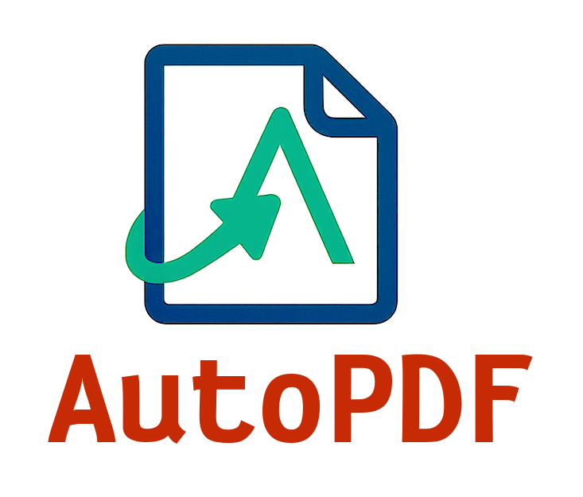
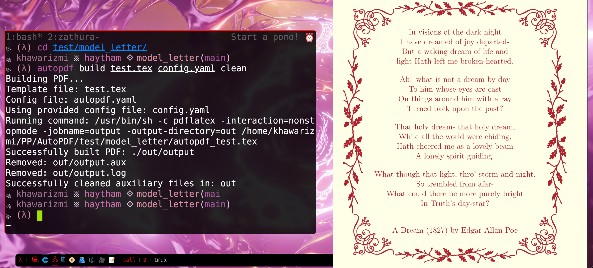

# 📄 AutoPDF

<div align="center">



**A powerful tool that creates PDFs using LaTeX and Go's templating syntax with advanced features.**

</div>

- :zap: **Simple. Neat. Fast. Powerful.** :zap:
- **Perfect for creating professional, customizable PDF documents**
- **Leverages the most powerful PDF document generator: $\LaTeX$**
- **Advanced templating with complex variables and for loops**
- **Persistent CLI settings and configuration management**
- **Built with DDD, SOLID principles, and GoF design patterns**

> _Like, Share, Subscribe, and Hit the Bell Icon!_

**Please do mention the software usage in your projects, products, etc.**

Built with ❤️ by [BuddhiLW](https://github.com/BuddhiLW). Using [Bonzai](https://github.com/rwxrob/bonzai) 🌳.

## Showcase

<div align="center">

</div>

## Install

```bash
go install github.com/BuddhiLW/AutoPDF/cmd/autopdf@latest
```

## Features

### 🚀 **Core Features**
- **LaTeX PDF Generation**: Professional document creation
- **Template Processing**: Go template syntax with custom delimiters
- **YAML Configuration**: Flexible and readable configuration
- **Multiple Engines**: Support for pdflatex, xelatex, and more
- **PDF Conversion**: Convert PDFs to images (PNG, JPEG, etc.)

### 🔧 **Advanced Features**
- **Complex Variables**: Nested objects, arrays, and mixed data types
- **For Loops**: Range loops over arrays and objects
- **Persistent Settings**: CLI settings that survive across sessions
- **Structured Logging**: Detailed logging with zap integration
- **Configuration Management**: Export/import configurations

### 🏗️ **Architecture**
- **Domain-Driven Design (DDD)**: Clear domain boundaries
- **SOLID Principles**: Maintainable and extensible code
- **GoF Design Patterns**: Factory, Builder, Strategy, Command
- **Clean Architecture**: Separation of concerns
- **Test-Driven Development**: Comprehensive test coverage

## Usage

### Basic Usage

```bash
# Simple document generation
autopdf build template.tex config.yaml

# With cleaning
autopdf build template.tex config.yaml clean

# With conversion
autopdf build template.tex config.yaml --convert png,jpeg
```

### Advanced Usage

```bash
# Complex variables with nested structures
autopdf build advanced_document.tex complex_config.yaml

# For loops with dynamic content
autopdf build loops_document.tex loops_config.yaml

# Persistent settings
autopdf verbose 3
autopdf clean on
autopdf debug switch
```

### Go Library

Use `pkg/api.Engine` when embedding AutoPDF. It provides a context-aware,
concurrency-safe contract without requiring imports from AutoPDF internals.

```go
engine, err := api.NewEngine()
if err != nil {
    return err
}

result, err := engine.Generate(ctx, api.Request{
    TemplatePath: "document.tex",
    OutputPath:   "output.pdf",
    Variables: map[string]string{
        "title": "Embedded AutoPDF",
    },
})
if err != nil {
    return err
}

fmt.Printf("generated %d bytes\n", len(result.PDF))
```

Custom renderers, caching layers, and test fakes can implement `api.Generator`
and be installed with `api.WithGenerator`. See [Embedding AutoPDF](docs/embedding.md)
for extension, logging, cancellation, and migration guidance.

### Configuration Examples

#### Basic Configuration
```yaml
template: "document.tex"
output: "output.pdf"
engine: "pdflatex"
variables:
  title: "My Document"
  author: "AutoPDF User"
  date: "2025-01-07"
```

#### Complex Variables
```yaml
template: "advanced_document.tex"
output: "advanced_output.pdf"
engine: "pdflatex"
variables:
  title: "Advanced Document"
  metadata:
    version: "1.0.0"
    tags: ["example", "advanced", "complex"]
    settings:
      verbose: true
      debug: false
  items:
    - name: "Feature 1"
      enabled: true
      priority: 1
    - name: "Feature 2"
      enabled: false
      priority: 2
```

### Template Syntax

#### Basic Variables
```latex
\title{delim[[.title]]}
\author{delim[[.author]]}
\date{delim[[.date]]}
```

#### Complex Variables
```latex
% Direct access to nested properties
Version: delim[[.metadata.version]]
Verbose: delim[[.metadata.settings.verbose]]

% Range loops over arrays
delim[[range .complex.metadata.tags]]
delim[[.]]\par
delim[[end]]

% Range loops over objects
delim[[range .complex.items]]
\subsection{delim[[.name]]}
Enabled: delim[[.enabled]]
Priority: delim[[.priority]]
delim[[end]]
```

## Examples

### 📁 **Test Examples**

The `test/` directory contains comprehensive examples:

#### Basic Usage (`test/basic_usage/`)
- Simple variable substitution
- Basic YAML configuration
- LaTeX document generation

#### Advanced Features (`test/advanced_features/`)
- Complex nested variables
- Range loops and dynamic content
- Mixed data types and structures

#### For Loops (`test/for_loops/`)
- Array iteration with `range` loops
- Object property access in loops
- Nested loop structures

#### Persistent Settings (`test/persistent_settings/`)
- CLI settings management
- Configuration persistence
- Cross-session settings

#### Legacy Examples
- `test/model_letter/`: Letter document example
- `test/model_xelatex/`: XeLaTeX engine example
- `test/complex_variables/`: Complex variable demonstration

### 🚀 **Quick Start**

1. **Install AutoPDF**:
   ```bash
   go install github.com/BuddhiLW/AutoPDF/cmd/autopdf@latest
   ```

2. **Try Basic Example**:
   ```bash
   cd test/basic_usage
   autopdf build document.tex config.yaml
   ```

3. **Explore Advanced Features**:
   ```bash
   cd test/advanced_features
   autopdf build advanced_document.tex config.yaml
   ```

4. **Test For Loops**:
   ```bash
   cd test/for_loops
   autopdf build loops_document.tex config.yaml
   ```

### 🛠️ **CLI Commands**

#### Build Commands
```bash
# Basic build
autopdf build TEMPLATE [CONFIG]

# With options
autopdf build TEMPLATE [CONFIG] [OPTIONS]
```

#### Setting Commands
```bash
# Verbose settings
autopdf verbose [LEVEL|on|off]

# Clean settings
autopdf clean [on|off|switch|status]

# Debug settings
autopdf debug [on|off|switch]

# Force settings
autopdf force [on|off|switch]
```

#### Utility Commands
```bash
# Clean auxiliary files
autopdf clean <path>

# Convert PDF to images
autopdf convert <pdf> <formats>
```

## License

This project is licensed under the [Apache License 2.0](LICENSE).
